# Skyward Raid 2077 / 空中突袭

  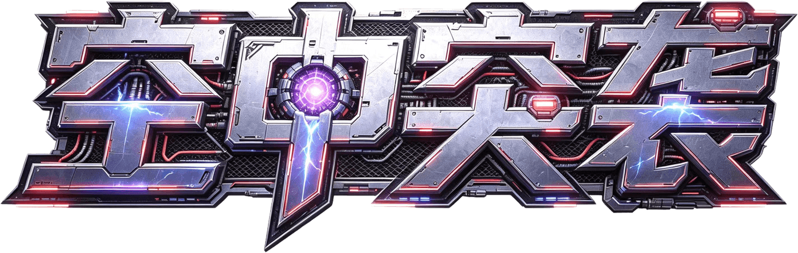
  
<strong>零构建 · 五机型 · 八战区 · 构筑无尽 · 竖屏弹幕空战</strong>

  

    <a href="https://ac-spider.github.io/skyward-raid-2077/"><strong>在线试玩</strong></a>
    · <a href="#快速开始">快速开始</a>
    · <a href="#操作">操作</a>
    · <a href="#开发与验证">开发与验证</a>
  

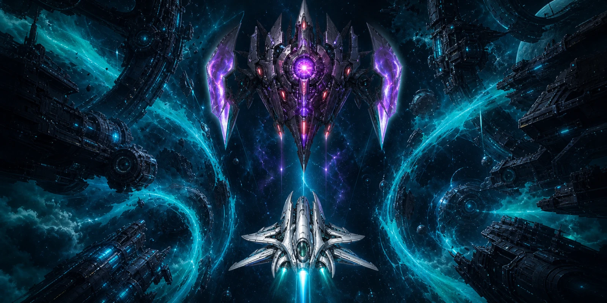

宣传主视觉；下方画廊均为当前版本真实游戏画面。

《空中突袭》是一款原生 HTML5 Canvas 竖屏空战游戏。驾驶五架定位鲜明的战机穿越 8 个战区与 24 个主线关卡，在多阶段 Boss、动态事件和高密度弹幕中维持火力、连击与生存；也可以进入经典无尽、构筑无尽或同种子 RIVAL 挑战，冲击浏览器本地记录。

无需构建、无需安装依赖。直接打开 <code>index.html</code> 或 <code>空中突袭.html</code> 即可运行。

## 实机画面

<table>
  <tr>
    <td width="50%" align="center">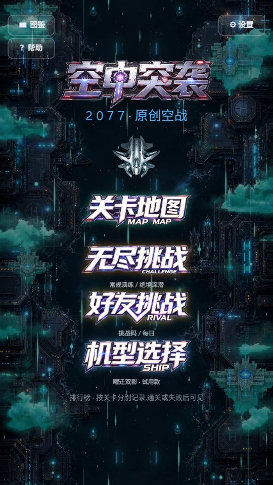</td>
    <td width="50%" align="center">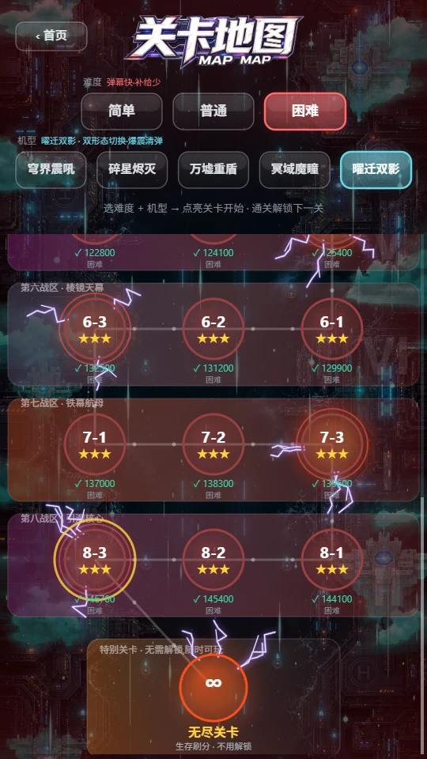</td>
  </tr>
  <tr>
    <td align="center">新版首页</td>
    <td align="center">后期战区地图</td>
  </tr>
  <tr>
    <td width="50%" align="center">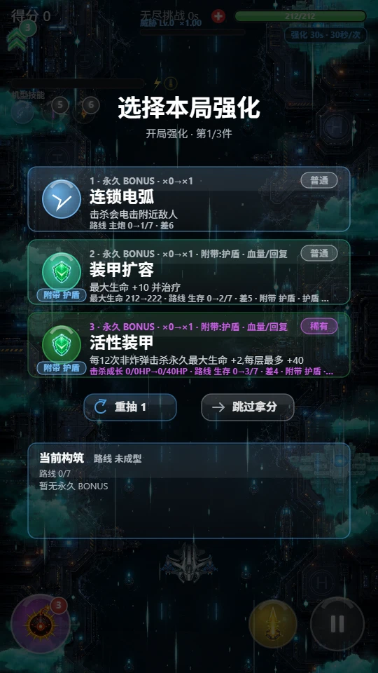</td>
    <td width="50%" align="center">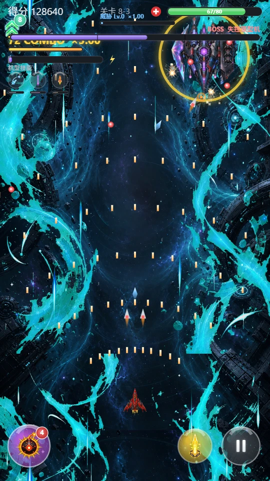</td>
  </tr>
  <tr>
    <td align="center">开局构筑</td>
    <td align="center">Boss 实战</td>
  </tr>
</table>

## 当前内容

| 8 | 24 + 1 | 5 | 20 | 11 |
| :-: | :-: | :-: | :-: | :-: |
| 战区 | 主线关卡 + 经典无尽 | 可选战机 | 敌机类型 | Boss |

| 50 | 28 | 23 | 8 × 3 | 10 |
| :-: | :-: | :-: | :-: | :-: |
| 构筑强化 | 无尽事件 | Boss 词缀 | 机装槽位 × 品阶 | 本地成就 |

此外还包含 5 类精英变体、5 种补给、7 类限时芯片、Boss 图鉴、关卡本地 Top 5、两套无尽榜单、挑战历史与 JSON 存档导入 / 导出。

## 现在能玩什么

| 模式 | 核心体验 | 记录方式 |
| --- | --- | --- |
| 主线战役 | 8 个战区、24 关；固定波次、复合敌群、多 Boss 车轮战与关底评分 | 每关最高分、通关难度与星级 |
| 经典无尽 | 地图末尾随时进入；纯生存刷分，不含抽卡、事件或 Boss 词缀 | 独立本地 Top 5 |
| 无尽挑战 | 常规演练 / 绝境深潜；开局构筑、动态事件、威胁等级与 Boss 词缀；绝境深潜在后期触发动态装甲校准 | 独立本地 Top 5 与战报 |
| RIVAL / 每日 | 挑战码固定种子与机型；每日固定当日种子并沿用所选机型；记录 30 / 60 / 120 秒分段 | 最近 8 条挑战历史 |
| WebRTC 实验入口 | 手动交换邀请与应答文本，同步半透明远端影子 | 不提供匹配、共享敌人或实时 PVE / PVP |

## 五架战机

<table>
  <tr>
    <td align="center">
      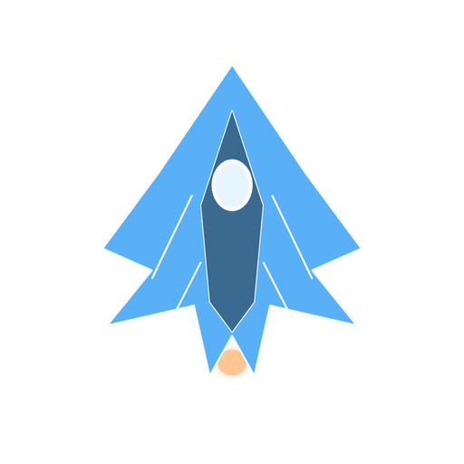 
      <strong>穹界震吼</strong> 
      平衡型 · 破阵冲击波
    </td>
    <td align="center">
      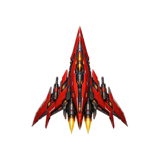 
      <strong>碎星烬灭</strong> 
      攻击型 · 全屏轰杀
    </td>
    <td align="center">
      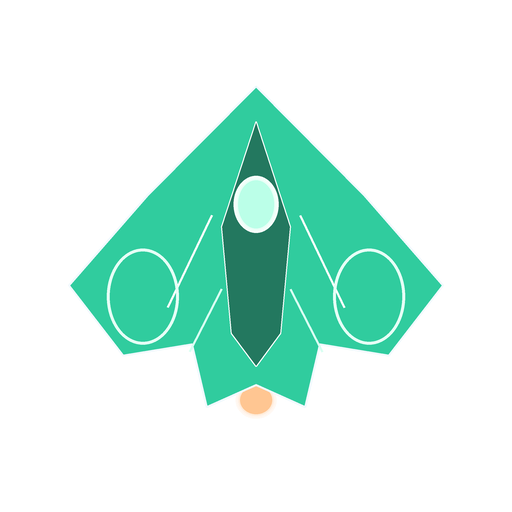 
      <strong>万墟重盾</strong> 
      防御型 · 护盾展开
    </td>
    <td align="center">
      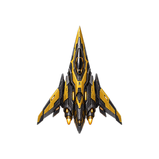 
      <strong>冥域魔瞳</strong> 
      侦查型 · 光学迷彩
    </td>
    <td align="center">
       
      <strong>曜迁双影</strong> 
      双形态 · 爆震切换
    </td>
  </tr>
</table>

- **穹界震吼**：均衡火力与操控，自带僚机；冲击波可以抵消沿途弹幕。
- **碎星烬灭**：高射速、高爆发，强化激光与蓄力；用更薄的装甲换取连击压制。
- **万墟重盾**：更高生命、减伤与炸弹储备；技能回复生命并展开多层护盾。
- **冥域魔瞳**：小判定、高机动、快速回能；光学迷彩会阻止敌机新锁定，但已有弹幕仍可命中。
- **曜迁双影**：普通 / 重炮双形态切换；爆震波清弹，形态护盾碎裂后还能清场与回血。

## 机装与构筑

每个战区对应一个机装槽位。首次启动会获得一套制式机装，关卡结算则按当前战区与难度继续掉落制式、精密或魄能装备；更高档机装会自动替换同槽位的低档版本。

<table>
  <tr>
    <td align="center"> 翼装</td>
    <td align="center"> 引擎</td>
    <td align="center"> 火控</td>
    <td align="center"> 装甲</td>
    <td align="center"> 航电</td>
    <td align="center"> 动力</td>
    <td align="center"> 挂架</td>
    <td align="center"> 异能</td>
  </tr>
</table>

完整无尽模式在持久机装之外再叠加局内构筑：50 项强化、7 类芯片、28 类动态事件与 23 种 Boss 词缀共同改变火力路线和风险收益。RIVAL / 每日入口统一停用持久机装；重打 RIVAL 挑战码时还会锁定记录中的种子与机型，并根据对手分段成绩生成间接干扰。

## Boss 来袭

主线包含 10 个 Boss；完整无尽存活 240 秒后，专属失控原型机会进入后续 Boss 轮换池。Boss 采用多种移动方式，并拥有各自的阶段攻击、清晰预警与反制窗口。

<table>
  <tr>
    <td align="center">
      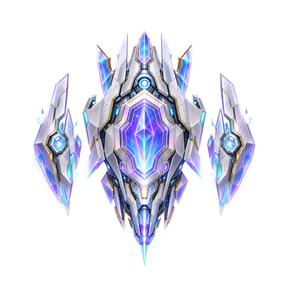 
      <strong>棱镜审判者</strong> 
      折射光束 · 安全航道
    </td>
    <td align="center">
      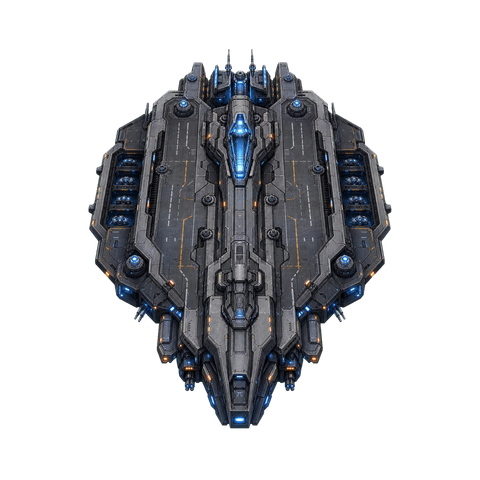 
      <strong>铁幕空母</strong> 
      护卫编队 · 甲板弱点
    </td>
    <td align="center">
      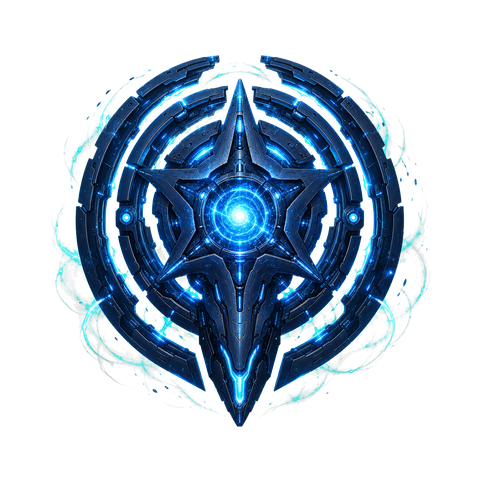 
      <strong>引潮核心</strong> 
      牵引潮汐 · 区域压迫
    </td>
    <td align="center">
      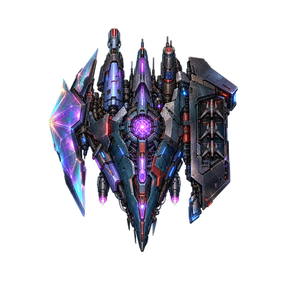 
      <strong>失控原型机</strong> 
      随机拼装 · 无尽威胁
    </td>
  </tr>
</table>

## 操作

玩家主炮自动开火，重点是移动、维持连击，并在正确时机使用炸弹、机型技能与蓄力攻击。

| 操作 | 键鼠 | 触屏 |
| --- | --- | --- |
| 移动 | 鼠标拖动 | 相对拖动，或在设置中切换虚拟摇杆 |
| 炸弹 | <code>B</code> / <code>Space</code> | 左下角炸弹按钮 |
| 机型技能 | <code>X</code> | 底部技能按钮，能量满后可用 |
| 蓄力攻击 | 按住 <code>C</code>，松开释放 | 右下角蓄力按钮 |
| 暂停 | <code>P</code> / <code>Esc</code> | 右下角暂停按钮 |
| 静音 | <code>M</code> | 设置页音乐 / 音效开关 |

画布按 540 × 960 逻辑分辨率设计，并支持高分屏 DPR、Pointer Events、多指操作与可选设备震动；浏览器不支持震动时会自动忽略。

## 快速开始

### 直接打开

下载仓库后双击 <code>index.html</code>。图片或音频未加载成功时，游戏仍会回退到 Canvas 绘制与 WebAudio 合成。

### 本地静态服务器

<pre><code>git clone https://github.com/Ac-spider/skyward-raid-2077.git
cd skyward-raid-2077
python -m http.server 4173 --bind 127.0.0.1</code></pre>

然后打开 <code>http://127.0.0.1:4173/</code>。

## 存档、榜单与挑战公平性

- 设置、关卡进度、机装、成就、排行榜与挑战历史保存在浏览器 <code>localStorage</code>。
- 设置页支持把完整存档导出为 JSON 文本，也可以导入到另一台设备。
- 所有排行榜均为浏览器本地榜，不是在线全球榜。
- RIVAL 挑战码固定记录中的种子与机型，每日挑战固定当日种子并沿用当前所选机型；两个入口都停用持久机装，分段成绩可用于复现对手节奏和生成间接干扰。

## 实验性 WebRTC

当前联机入口是轻量点对点实验：房主和加入者手动交换邀请 / 应答文本，通过浏览器原生 WebRTC DataChannel 同步位置、生命、机型和游戏状态，并绘制半透明远端影子。

它不包含匹配服务器、TURN 中继、共享敌人、共享伤害或完整实时 PVE / PVP。单机体验仍然是主要玩法。

## 技术结构

项目保持轻量静态站点结构，<code>main</code> 分支根目录可以直接发布到 GitHub Pages。

<pre><code>.
├─ index.html                 # GitHub Pages 默认入口
├─ 空中突袭.html              # 同脚本的中文兼容入口
├─ style.css                  # 页面布局与 Canvas 容器
├─ assets/
│  ├─ audio/                  # BGM、音效与来源说明
│  └─ images/                 # 战机、敌机、Boss、背景、UI 与 README 画面
├─ src/
│  ├─ config.js               # 数值、机型、Boss、强化、机装与规则
│  ├─ assets.js               # 图片清单、分层加载与 Canvas 兜底
│  ├─ services.js             # 音频、设置、存档、榜单与成就
│  ├─ canvas.js               # Canvas 初始化与自适应
│  ├─ input.js                # 鼠标、触摸与键盘输入
│  ├─ core.js                 # 通用工具、UI 与背景
│  ├─ entities.js             # 玩家、敌机、Boss、投射物与对象池
│  ├─ levels.js               # 关卡波次与导演器
│  ├─ interference.js         # RIVAL 间接干扰
│  ├─ multiplayer.js          # WebRTC 与远端影子同步
│  ├─ game.js                 # 状态、碰撞、HUD 与界面
│  └─ main.js                 # 初始化与主循环
├─ tools/
│  └─ sync-html.js            # 同步两个 HTML 入口
└─ scripts/
   └─ check_balance.js        # 配置与运行时回归检查</code></pre>

## 开发与验证

- 保持零构建链、零重型框架，优先复用现有模块。
- <code>index.html</code> 与 <code>空中突袭.html</code> 必须加载同一套脚本。
- 可选标题、芯片、BONUS 与事件图需要在 <code>ImageAssets.manifest</code> 登记；动态特效和 UI 图标则加入对应预载清单，以纳入预载与存在性检查。
- 单机玩法优先；<code>multiplayer.js</code> 只负责连接与同步外壳。

调整入口脚本后同步 HTML：

<pre><code>node tools/sync-html.js</code></pre>

代码或配置改动后至少运行：

<pre><code>node scripts/check_balance.js</code></pre>

当前检查覆盖配置数量与引用、状态切换、对象池复用、Boss 阶段、设置归一化、预载资源存在性以及双入口一致性。

需要浏览器验证时启动本地服务器，并至少检查首页、关卡地图、无尽模式、设置、机型 / 机装页以及浏览器控制台。

## 素材与说明

- README 宣传图与实机截图来源：[assets/images/readme/SOURCES.md](assets/images/readme/SOURCES.md)
- 图片生成 / 重绘提示词：[assets/images/image2-redraw-prompts.md](assets/images/image2-redraw-prompts.md)
- 新敌机与 Boss 提示词：[assets/images/image2-new-enemy-boss-prompts.md](assets/images/image2-new-enemy-boss-prompts.md)
- 特效与 UI 提示词：[assets/images/image2-effects-ui-prompts.md](assets/images/image2-effects-ui-prompts.md)
- 音频来源：[assets/audio/SOURCES.md](assets/audio/SOURCES.md)

仓库目前没有统一的 <code>LICENSE</code> 文件。复用、二次分发代码或素材前，请先向维护者确认授权范围。

## 发布

GitHub Pages 直接从 <code>main</code> 分支根目录发布。保持两个入口可运行并推送到发布分支后，即可更新[在线试玩版本](https://ac-spider.github.io/skyward-raid-2077/)。
